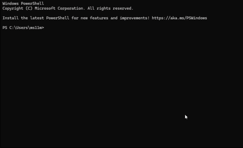

<p align="center">
  <a href="https://github.com/momo-s15/aeroform">
    
  </a>
</p>

<p align="center">
  <h1 align="center">Aeroform</h1>
  <p align="center">
    From a student's first website to a company's production cluster — in one command.
  </p>
</p>

<p align="center">
  <a href="https://github.com/momo-s15/aeroform/actions/workflows/ci.yml"></a>
  <a href="https://github.com/momo-s15/aeroform/actions/workflows/security.yml"></a>
  <a href="https://github.com/momo-s15/aeroform/releases/latest"></a>
  <a href="https://pkg.go.dev/github.com/momo-s15/aeroform"></a>
  <a href="LICENSE"></a>
  
</p>

---

Aeroform is an open-source CLI that turns plain English into cloud infrastructure. Describe what you want, and Aeroform picks the right Terraform templates, estimates costs, runs security checks, and deploys — across AWS, Azure, and GCP.

**Two modes, one tool:**

- **Simple Mode** — guided prompts, cost estimates in dollars, auto-security. Built for students and solo developers.
- **Pro Mode** — `config.yaml`-driven, multi-template composition, Checkov/tfsec gating, workspace environments. Built for teams.

<!-- TODO: Replace with actual terminal recording -->
<!-- <p align="center">
  
</p> -->

---

## Quick Start

<table>
<tr>
<td width="50%" valign="top">

### Simple Mode

```bash
# 1. Install (or: curl -fsSL https://raw.githubusercontent.com/momo-s15/aeroform/main/install.sh | sh)
go install github.com/momo-s15/aeroform@latest

# 2. Setup AI backend
aeroform setup

# 3. Deploy
aeroform launch
```

Aeroform asks what you want to build, picks a template, shows costs, and deploys.

</td>
<td width="50%" valign="top">

### Pro Mode

```bash
# 1. Install (or use install.sh — see Installation above)
go install github.com/momo-s15/aeroform@latest

# 2. Create config
aeroform init

# 3. Preview
aeroform plan "kubernetes cluster with database"

# 4. Deploy
aeroform generate "kubernetes cluster with database"
```

</td>
</tr>
</table>

**Runtime prerequisites (after install):** [Terraform](https://developer.hashicorp.com/terraform/install) | [Ollama](https://ollama.com/download) (for local AI) | Cloud CLI authenticated

---

## Installation

| Method | Audience | Command / action |
|--------|----------|------------------|
| **1. Install script** (macOS / Linux) | Most users — no Go required | `curl -fsSL https://raw.githubusercontent.com/momo-s15/aeroform/main/install.sh \| sh` |
| **2. Homebrew** | Mac/Linux developers | *Planned v1.1.0* — tap + formula (see [docs/installation.md](docs/installation.md)) |
| **3. go install** | Contributors / Go users | `go install github.com/momo-s15/aeroform@latest` (needs [Go 1.26.1+](https://go.dev/dl/)) |
| **Windows** | All | Download `aeroform-windows-amd64.exe` or `aeroform-windows-arm64.exe` from [Releases](https://github.com/momo-s15/aeroform/releases) and add to `PATH` |

Optional: pin a version with the script — `AEROFORM_VERSION=v1.0.2 curl -fsSL ... | sh`. Full detail: **[docs/installation.md](docs/installation.md)**.

---

## How It Works

```
You: "I want a portfolio website"
                │
                ▼
        ┌───────────────┐
        │  Local LLM    │  Selects from validated templates
        │  (Ollama)     │  (never generates raw Terraform)
        └───────┬───────┘
                │
                ▼
        ┌───────────────┐
        │  Security     │  Auto-correction + Checkov scan
        │  Gate         │  Blocks unsafe configurations
        └───────┬───────┘
                │
                ▼
        ┌───────────────┐
        │  Cost         │  Estimate before you spend
        │  Estimate     │  Free-tier aware
        └───────┬───────┘
                │
                ▼
        ┌───────────────┐
        │  Terraform    │  init → plan → apply
        │  Deploy       │  With confirmation prompt
        └───────────────┘
```

The LLM is a **selection** mechanism, not a generation mechanism. It picks from pre-validated, security-hardened templates. This means every deployment uses reviewed Terraform that passes security scanning — even with a small local model.

---

## Templates

### Simple Mode — 14 templates across 3 clouds

<table>
<tr><th>AWS</th><th>Cost</th><th>Azure</th><th>Cost</th><th>GCP</th><th>Cost</th></tr>
<tr><td>static-site</td><td>$0.50</td><td>static-site</td><td>$1.00</td><td>static-site</td><td>$0.50</td></tr>
<tr><td>contact-form</td><td>$0.50</td><td>function-api</td><td>$0.00</td><td>cloud-run-api</td><td>$0.00</td></tr>
<tr><td>lambda-api</td><td>$0.00</td><td></td><td></td><td></td><td></td></tr>
<tr><td>tiny-db</td><td>$14.99</td><td></td><td></td><td></td><td></td></tr>
<tr><td>discord-bot</td><td>$8.00</td><td></td><td></td><td></td><td></td></tr>
<tr><td>game-server</td><td>$30.00</td><td></td><td></td><td></td><td></td></tr>
<tr><td>fullstack-app</td><td>$15.00</td><td></td><td></td><td></td><td></td></tr>
<tr><td>file-upload</td><td>$0.00</td><td></td><td></td><td></td><td></td></tr>
<tr><td>url-shortener</td><td>$0.00</td><td></td><td></td><td></td><td></td></tr>
<tr><td>cron-job</td><td>$0.00</td><td></td><td></td><td></td><td></td></tr>
</table>

### Pro Mode — 18 templates across 3 clouds

| AWS | Cost | Azure | Cost | GCP | Cost |
|-----|------|-------|------|-----|------|
| vpc | $32.40 | vnet | $0.00 | vpc | $32.40 |
| eks | $73.00 | aks | $73.00 | gke | $73.00 |
| rds-private | $15.00 | cosmos-db | $25.00 | cloudsql | $7.67 |
| s3-private | $0.50 | app-service | $13.14 | gcs | $0.50 |
| alb | $22.00 | storage | $1.00 | | |
| lambda-api | $0.00 | key-vault | $0.03 | | |
| ecs-fargate | $36.00 | | | | |
| cloudfront-api | $1.00 | | | | |

Costs are estimates for the smallest viable configuration. Many templates are free-tier friendly.

See the full [Template Reference](docs/template-reference.md) for resource details.

---

## Free Local AI

Aeroform uses [Ollama](https://ollama.com) by default — a local LLM that runs on your machine. No API keys, no cloud costs, no data leaving your laptop.

```bash
aeroform setup              # installs llama3.2 (~2GB)
aeroform setup --model mistral  # or pick a different model
```

Also supports [OpenAI](docs/llm-backends.md#openai) and [AWS Bedrock](docs/llm-backends.md#aws-bedrock) for teams that prefer cloud-hosted models.

---

## Security

Every deployment passes through a security gate before Terraform runs.

| Feature | Simple Mode | Pro Mode |
|---------|------------|----------|
| Auto-correction | Yes (encryption, HTTPS, private DB) | — |
| Checkov scan | Yes (if installed) | Required |
| tfsec scan | — | Yes (if installed) |
| Custom policies | — | `aeroform policy add check.py` |
| Gate behavior | Blocks HIGH severity | Blocks any failure |
| Finding format | Plain English | Technical scanner output |

All templates are pre-hardened: encryption at rest, public access blocked, least-privilege IAM, TLS enforced.

Read more in the [Security Model](docs/security-model.md) docs.

---

## Key Commands

| Command | Mode | What it does |
|---------|------|-------------|
| `aeroform setup` | Both | Install and verify local AI backend |
| `aeroform launch` | Simple | Guided deploy from plain English |
| `aeroform status` | Simple | Show tracked projects |
| `aeroform cost` | Simple | Show estimated monthly spend |
| `aeroform destroy --confirm` | Simple | Tear down tracked projects |
| `aeroform init` | Pro | Scaffold config.yaml |
| `aeroform bootstrap --repo` | Pro | Generate OIDC + state backend setup |
| `aeroform plan "prompt"` | Pro | Dry-run: select, scan, plan |
| `aeroform generate "prompt"` | Pro | Full pipeline: scan, plan, apply |
| `aeroform scan` | Pro | Standalone security scan |
| `aeroform drift <project>` | Both | Detect infrastructure drift |
| `aeroform env add <name>` | Pro | Create environment workspace |
| `aeroform policy add <file>` | Pro | Add custom Checkov policy |

---

## Upgrade Path

When a Simple Mode project outgrows guided deployment:

```bash
aeroform upgrade           # preview the generated config
aeroform upgrade --confirm # write config.yaml and enable Pro Mode
```

Same templates, same security, more control.

---

## Project Structure

```
aeroform/
├── cmd/                    Cobra command definitions
├── internal/
│   ├── config/             Viper config loading + validation
│   ├── cost/               Cost estimation (Simple + Pro, per-cloud)
│   ├── engine/             Simple/Pro planners, drift detection
│   ├── llm/                Ollama, OpenAI, Bedrock backends
│   ├── logger/             Zap structured logging
│   ├── providers/          AWS, Azure, GCP implementations
│   ├── security/           Scanning, auto-correction, policies
│   ├── terraform/          Renderer, runner, workspace mgmt
│   └── ui/                 Colored terminal output
├── bootstrap/              Cloud OIDC + state bootstrap
├── templates/
│   ├── simple/{cloud}/     14 Simple Mode templates
│   └── pro/{cloud}/        18 Pro Mode templates
├── docs/                   Full documentation site
└── test/
    ├── integration/        LocalStack-based tests
    └── e2e/                Real cloud deploy/destroy tests
```

---

## Documentation

| Page | Description |
|------|-------------|
| [Documentation home](docs/index.md) | Overview, requirements, CI/contributing links |
| [Installation](docs/installation.md) | Install script, Homebrew (planned), go install, Windows |
| [Getting Started — Simple](docs/getting-started-simple.md) | Install to deployed website in 5 minutes |
| [Getting Started — Pro](docs/getting-started-pro.md) | Config to EKS cluster with security gating |
| [Template Reference](docs/template-reference.md) | All 32 templates with resources and costs |
| [LLM Backends](docs/llm-backends.md) | Ollama, OpenAI, Bedrock setup |
| [Security Model](docs/security-model.md) | Scanning, policies, auto-correction |
| [Architecture Decisions](docs/architecture-decisions.md) | Design rationale and trade-offs |

---

## Development

From a clone of the repo:

```bash
go test ./...                 # unit tests
golangci-lint run ./...       # lint (config: .golangci.yml, golangci-lint v2)
make integration              # Docker + LocalStack + integration tests
```

CI runs **lint**, **unit**, and **integration** (LocalStack service container) on every push/PR; **govulncheck** runs under **Security**. **E2E** (real AWS) runs on `v*` tags when repository/environment secrets are configured; otherwise it skips. See [CONTRIBUTING.md](CONTRIBUTING.md).

---

## Contributing

We welcome contributions. See [CONTRIBUTING.md](CONTRIBUTING.md) for workflow, expectations, and good first issues.

## Reporting vulnerabilities

For vulnerability reports, see [SECURITY.md](SECURITY.md).

## License

Apache 2.0 — see [LICENSE](LICENSE).
